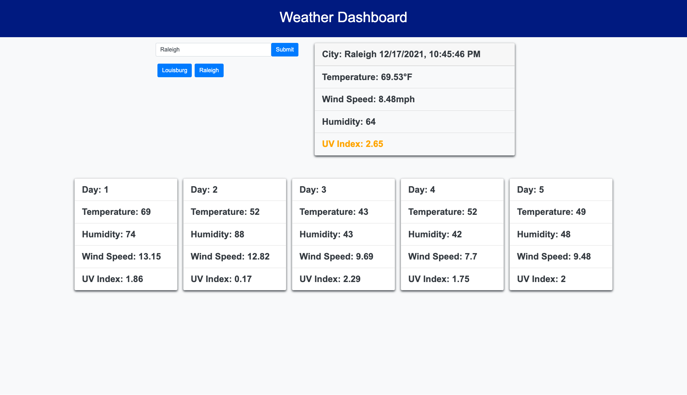

# **Weather Dashboard**
***

## Table of Contents
1. [Description](#description)  
2. [Links](#links)  
3. [Visuals](#visuals)  
***

## Description
This **Weather Dashboard** provides users with a way to see the weather outlook for multiple cities so that they can plan trips accordingly. It has built-in inputs so that when the user searches for a city they are presented with current and future conditions for that city. That city is then added to the search history. When the user views current weather conditions for that city they are presented with the city name, the date, an icon representation of weather conditions, the temperature, the humidity, the wind speed, and the UV index.

When the user views the UV index they're presented with a color that indicates whether the conditions are favorable, moderate, or severe. When they view future weather conditions for that city they are presented with a 5-day forecast that displays the date, an icon representation of weather conditions, the temperature, the wind speed, and the humidity. When a city in the search history is clicked they are once again presented with current and future conditions for that city.

***

## Links
[Link to Weather Dashboard](https://mattholtmoore.github.io/weather-dashboard-project/)

[Link to GitHub](https://github.com/mattholtmoore/weather-dashboard-project)  
***

## Visuals

 